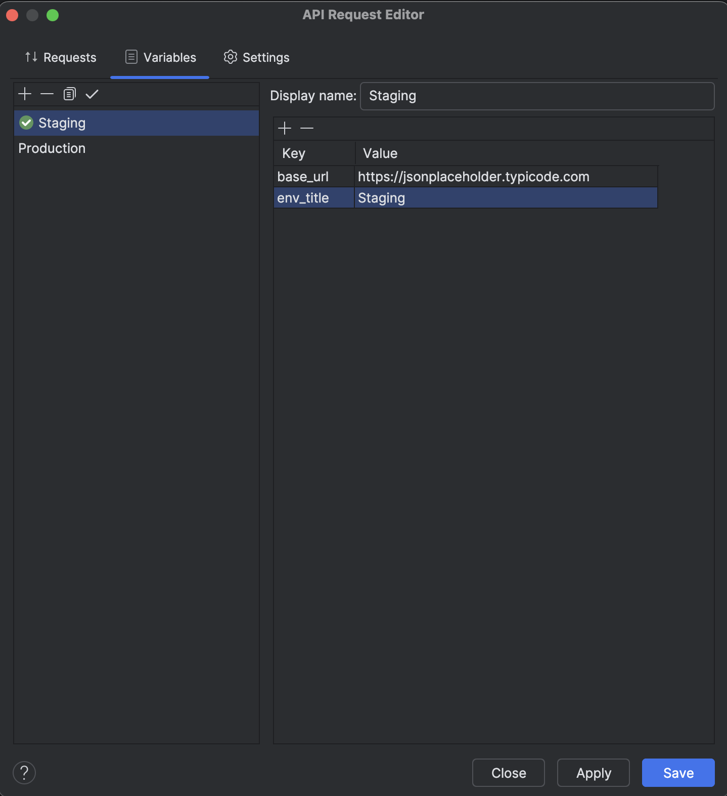
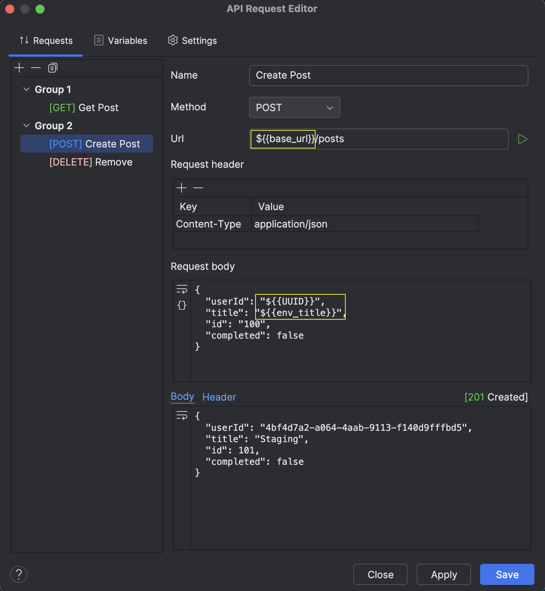
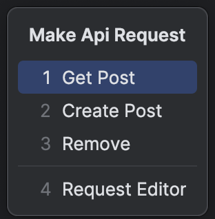

# API Bank

<!-- Plugin description -->
A plugin to quickly make API requests in Intellij based IDE:

* Create request using url, method, body and header in an editor dialog.
* Create collections of environment variables, for e.g. development, production etc.
* Quickly access and execute API requests via quick select popup.

<!-- Plugin description end -->

## Installation
### Option 1
<a href="https://plugins.jetbrains.com/plugin/20522-api-bank">Install plugin from JetBrains Marketplace</a>
### Option 2
1. Clone this project
2. Build the plugin `./gradlew buildPlugin`
3. Use `Install Plugin from Disk` action to install the plugin located at `/build/distributions/api-bank.zip`
## Usage Guide

### 1. Editor


1. Open the editor via ```Tools -> API Bank -> Request Editor``` or use hotkey ```alt+shift+e```(win) or```option+shift+e```(mac)
2. Click the ```+``` icon on top-left
3. Enter your request details, e.g.
    1. Name: ```Create User```
    2. Method: ```POST```
    3. Url: ```https://jsonplaceholder.typicode.com```
    4. Body: ``` {
       "title": "Hello",
       "body": "World!",
       "userId": 55
       }```.
    5. Add a new header row by clicking ```+``` icon with key as ```Content-type``` and value
       as ```application/json; charset=UTF-8```.
    6. Click the green play icon (or double-click the item name from the list on the left) to execute.

### 2. Environment Variables

1. Create variables using Variables tab

   

2. Use them in request

   

#### Notes:

1. Only one set can be active at a time denoted by green checkmark.
2. Use syntax ```${{my_key}}``` to use variable in a request.
3. In request body, use quotes for string variable types. Don't use quotes for numbers and boolean. e.g,
    1. ```{ "name": "${{my_string_var}}" }```
    2. ```{ "count": ${{my_number_var}} }```
    3. ``` { "isValid": ${{my_boolean_var}} }```
4. Plugin provides ```${{UUID}}```by default that generates random UUID.

### 3. Quick select popup

1. Open the popup via ```Tools -> API Bank -> Request Quick Select```or use shortcut key ```alt+shift+s```(win) or```option+shift+s```(mac)
2. Select a request to execute
3. A notification bubble will show up displaying the response code and message.



## License

```
MIT License

Copyright (c) [2022] [Prabin Timsina]

Permission is hereby granted, free of charge, to any person obtaining a copy
of this software and associated documentation files (the "Software"), to deal
in the Software without restriction, including without limitation the rights
to use, copy, modify, merge, publish, distribute, sublicense, and/or sell
copies of the Software, and to permit persons to whom the Software is
furnished to do so, subject to the following conditions:

The above copyright notice and this permission notice shall be included in all
copies or substantial portions of the Software.

THE SOFTWARE IS PROVIDED "AS IS", WITHOUT WARRANTY OF ANY KIND, EXPRESS OR
IMPLIED, INCLUDING BUT NOT LIMITED TO THE WARRANTIES OF MERCHANTABILITY,
FITNESS FOR A PARTICULAR PURPOSE AND NONINFRINGEMENT. IN NO EVENT SHALL THE
AUTHORS OR COPYRIGHT HOLDERS BE LIABLE FOR ANY CLAIM, DAMAGES OR OTHER
LIABILITY, WHETHER IN AN ACTION OF CONTRACT, TORT OR OTHERWISE, ARISING FROM,
OUT OF OR IN CONNECTION WITH THE SOFTWARE OR THE USE OR OTHER DEALINGS IN THE
SOFTWARE.
```
